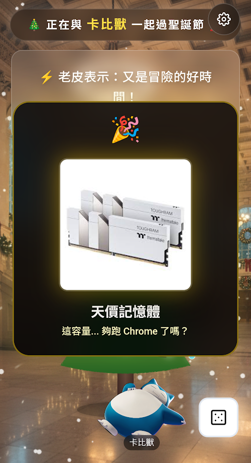

# 🎄 Christmas Interactive Space 🎅
[](https://github.com/gerry1204/christmas-interactive-space/actions/workflows/deploy.yml)

一個充滿節日氛圍的互動式網頁，讓你的螢幕充滿聖誕氣息！✨節打造。在這個虛擬空間中，您可以切換不同的場景、召喚可愛的夥伴、調整聖誕樹的燈光氛圍，並聆聽放鬆的 Lo-Fi 音樂。


## ✨ 特色功能 (Features)

### 1. 🌟 互動式聖誕樹 (Realistic Interactive Tree)
- **逼真質感**：採用 SVG 分層渲染，模擬真實松葉紋理與纏繞的燈串。
- **多種燈光模式**：
  - **單色恆亮 (Static)**：經典且溫馨，支援自訂顏色與玻璃透亮質感。
  - **彩虹閃爍 (Rainbow)**：動態變換的七彩燈光效果。
  - **呼吸律動 (Breathing)**：柔和的忽明忽暗效果，營造寧靜氛圍。
- **完全客製化**：可自由調整燈光 **亮度**、**閃爍速度** 以及 **燈泡顏色**。

### 2. 🏠 場景與氛圍 (Scenes & Atmosphere)
- 提供多種精美背景場景（如：溫馨實驗室、雪景窗邊等），點擊左側選單即可切換。
- **動態雪花**：全螢幕的飄雪效果，增添冬日氣息。

### 3. 👾 夥伴召喚 (Character Companion)
- **多樣化角色**：收錄了豐富的客串角色，包括 老皮、哆啦A夢、烏薩奇、卡比獸、派大星 等。
- **互動操作**：
  - **跟隨模式**：角色會跟隨滑鼠游標移動。
  - **固定模式**：點擊畫面任意處，即可將角色固定在該位置。

### 4. 🎁 驚喜禮物與祝福 (Gifts & Blessings)
- **聖誕樹祝福**：聖誕樹上方的氣泡會顯示隨機的暖心祝福語，點擊可切換。
- **隨機禮物骰子**：
  - 點擊聖誕樹右下角的 **骰子按鈕**，即可召喚禮物從天而降！
  - **機率機制**：
    - 🎉 **80% 好禮物**：如 顯卡、電競主機、比特幣、熱可可等。
    - 😈 **20% 惡作劇**：如 三角錐、工地帽、藍屏畫面、加班券等。
  - 每個禮物都有專屬的圖片與說明卡片，快來試試手氣！

### 5. 📱 響應式設計 (Responsive Design)
- **桌面版優化**：
  - **左側邊欄**：場景切換、角色選擇。
  - **右側邊欄**：燈光控制、音樂播放。
- **手機版優化**：
  - 自動隱藏兩側面板，保留乾淨的主視覺。
  - **專屬設定按鈕**：右上角提供浮動按鈕，開啟全螢幕控制台，單手也能輕鬆調整所有設定。

### 6. 🎵 音樂播放器 (Music Player)
- 內建精選 Lo-Fi 聖誕背景音樂。
- 支援播放/暫停與曲目切換。
- 顯示現在播放 (Now Playing) 資訊。

## 🛠️ 技術棧 (Tech Stack)
- **React 18**
- **TypeScript**
- **Vite**
- **Tailwind CSS**

## 🚀 如何執行 (How to Run)

1. **安裝依賴**
   ```bash
   npm install
   ```

2. **啟動開發伺服器**
   ```bash
   npm run dev
   ```

3. **開啟瀏覽器**
   前往終端機顯示的網址 (通常是 `http://localhost:5173`) 即可體驗！

## 🎮 操作指南

- **桌機版**：直接使用畫面兩側的半透明懸浮面板進行設定。
- **手機版**：點擊畫面右上角的「設定 (⚙️)」圖示，展開完整控制選單。
- **角色互動**：選取角色後，角色預設會跟隨滑鼠；**點擊左鍵**可將其固定在原地，再次點擊則恢復跟隨。

---
祝您聖誕快樂！ Merry Christmas! 🎅🎁
